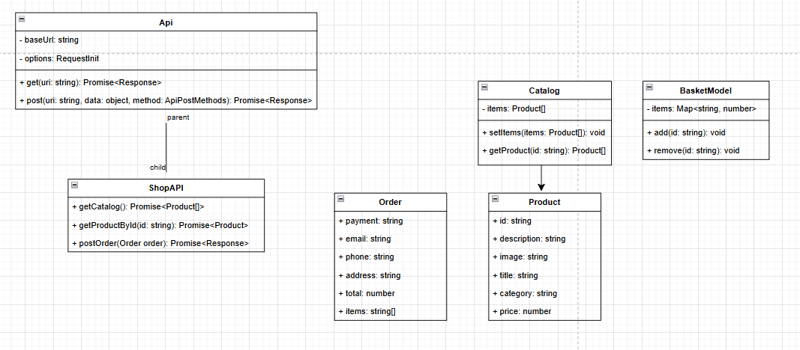

# Проектная работа "Веб-ларек" - интернет-магазин с товарами для веб-разработчиков

## Описание проекта
"Веб-ларек" - интернет-магазин с товарами для веб-разработчиков. В нём можно посмотреть
каталог товаров, добавить товары в корзину и сделать заказ, при оформлении
пользователю необходимо ввести способ оплаты, email, номер телефона, адрес

Проект реализован на TypeScript и представляет собой SPA (Single Page Application) с использованием API для получения данных о товарах и создание заказа. Также на странице
есть модальные окна карточки товара, корзины и оформления заказа.

## Установка и запуск
Для установки и запуска проекта необходимо выполнить команды

```
npm install
npm run start
```

или

```
yarn
yarn start
```
## Сборка

```
npm run build
```

или

```
yarn build
```

Стек: HTML, SCSS, TS, Webpack

Структура проекта:
- src/ — исходные файлы проекта
- src/components/ — папка с JS компонентами
- src/components/base/ — папка с базовым кодом

Важные файлы:
- src/pages/index.html — HTML-файл главной страницы
- src/types/index.ts — файл с типами
- src/index.ts — точка входа приложения
- src/scss/styles.scss — корневой файл стилей
- src/utils/constants.ts — файл с константами
- src/utils/utils.ts — файл с утилитами

## Архитектура проекта (MVC)


# Отображения

```ts
interface IView {
	render(data?: object): HTMLElement;
}

class BasketView implements IView {
    constructor(protected container: HTMLElement) {}
    render(data: { items: HTMLElement[] }) {
        if (data) {
			this.container.replaceChildren(...data.items);
		}
		return this.container;
    }
}
```

# Модели
Есть IBasketModel который умеет добавлять и удалять определённые элементы из списка

```ts
interface IBasketModel {
	items: Map<string, number>;
	add(id: string): void;
	remove(id: string): void;
}
```

# Контроллеры

Брокер событий
```ts
interface IEventEmitter {
	emit: (event: string, data: unknown) => void;
}
```

Например в данном случае мы слушаем события 'basket:change', 'ui:basket-add',
'ui:basket-remove' и в зависимости от события делаем разные действия, рендерим корзину,
добавляем новый элемент в корзину, удаляем элемент из корзины
```ts
events.on('basket:change', (event: { items: string[] }) => {
	renderBasket(event.items);
});

events.on('ui:basket-add', (event: { id: string }) => {
	basketModel.add(event.id);
});

events.on('ui:basket-remove', (event: { id: string }) => {
	basketModel.remove(event.id);
});

```